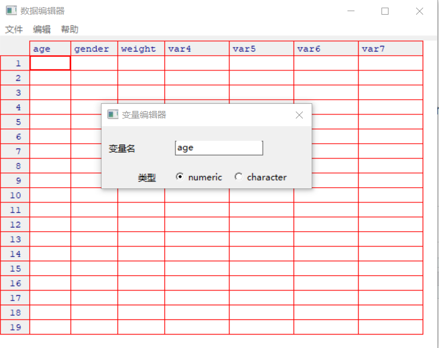

## 外部数据导入

R 很少作为一个数据输入软件，而只作为一个数据分析软件。这里简单介绍在 R 中直接输入数据的方式，重点在于说明如何导入外部数据。这里仅说明如何导入常用的、通常以数据框形式存在的数据。

导入这些外部数据通常需要安装其他相关 R 包。常用的包有：

- **foreign** 包，R 默认安装，可导入SPSS、Stata、Sas 格式的数据
- **Hmisc** 包，可导入 SPSS、Stata、Sas 格式的数据
- **openxlsx** 包，可导入 Excel 格式数据
- [Hadley](http://hadley.nz/) 开发的 R 包，如 **haven** 等，可导入各类数据
- **sas7bdat** 包，可导入 Sas 格式数据
- **memisc** 包，可导入 SPSS、Stata 格式数据

这里择要进行介绍。以下假定读者已安装各相关 R 包。

### 键盘输入

使用 R 内置的文本编辑器，可以弹出类似 Excel 的数据输入界面，但是非常朴素，通常在数据较少时使用。R 中的函数 `edit()` 会自动调用一个可手动输入数据的文本编辑器。步骤如下：

- 创建一个空数据框（或矩阵），其中变量名和变量的模式要与理想中的最终数据集一致

- 针对此数据对象调用文本编辑器，输入数据并将结果保存回此数据对象中

例：创建一个名为 data 的数据框，它含有三个变量： age（数值型）、 gender（字符型）和 weight（数值型）。

```r
data <- data.frame(age = numeric(0), gender = character(0), weight = numeric(0))
data <- edit(data)
```
调用 `edit()` 函数后结果如图：



- 单击列的标题，可以修改变量名与变量类型
- 单击未使用的标题可以添加新的变量
- 编辑器关闭后，结果会保存到之前赋值的对象中。

应注意的是， `edit()` 是在数据对象的副本上进行操作的。若未将其赋值到到原有对象中，所有修改将会丢失。

### 导入文本格式数据

#### `read.table()`函数

纯文本文档数据，可用 `read.table()` 函数，语法如下：

```r
file <- read.table("xxx.txt", header = , sep = "", ...)
```

其中，

- `xxx`表示待读取的文件名
- `header = TRUE`表示将数据第一行读为变量名（默认选项），`header = FALSE`表示不将数据第一行读为变量名
- `sep = ""`表示分隔符，引号中可填入空格（即`" "`，两个引号之间有一个英文空格）、回车符（`\r`）、换行符（`\n`）、制表符（`\t`）等
- `...`表示其他参数，具体可使用`?read.table()`查询

#### `read.delim()`函数

类似的函数还有`read.delim()`，语法如下：

```r
read.delim(file, header = TRUE, sep = "\t", ...)
```
在`sep = `后输入其他符号，可以导入不同分隔符的文本数据。

#### `scan()` 函数

读取数据时，`scan` 函数可以指定输出变量的数据类型，输出形式可以是向量、矩阵、数据框、列表等。语法如下：

```r
scan(file = "", sep = "", ...)
```
其中

- `file` 表示文件名(在""之内)
- `sep = ""`用于指定分隔符
- 有关其他参数说明，请参考 `?scan()`

#### `read.csv()`函数

`csv`文档可理解为特殊格式的`txt`文档，其后缀名为`.csv`，意为逗号分隔值（comma separated values），是常见的通用文件格式，也是跨系统储存数据时的首选文件格式。它可直接使用`read.csv()`函数读取，语法如下：

```r
file <- read.csv("xxx.csv", ...)
```

其中，

- `xxx`表示待读取的文件名
- `...`表示其他参数，形式同`read.table()`函数，具体也可使用`?read.csv()`查询


### 导入 Excel 格式数据

对已安装 Office 软件的用户，推荐先将 Excel 文件导出为`csv`文件，再使用`read.csv()`导入。如想直接导入 Excel 格式数据，通常需要安装相关 R 包。

如果已经安装了 Java 环境的用户，传统上可通过安装 **xlsx** 包来导入 Excel 数据。但 Java 环境并非由 Windows 平台默认安装，需用户自行下载安装，稍显繁琐。现在，也可使用 **openxlsx** 包中的`read.xlsx()`函数来实现同样功能，此包无须安装 Java 环境，更值得推荐。用法如下：

```r
library(openxlsx)
file <- read.xlsx("xxx.xlsx", sheet = 1)
```

其中， `sheet = 1`表示读入第一个表单的数据，可通过输入不同数字或表单名来指定要读入的表单。

### 导入 SPSS 格式数据

通过 **foreign** 包中的`read.spss()`函数可以导入相关文件，**foreign** 包已默认安装，但使用时仍需调用。

```r
library(foreign)
file <-
  read.spss("xxx.sav",
            use.value.labels = TRUE,
            to.data.frame = FALSE,
            ...)
```

其中，
- `xxx.sav`表示文件名
- `file, use.value.labels = TRUE`表示默认读入原始文件中的标签
- `to.data.frame = FALSE`默认不将数据读为数据框而是列表，一般宜设置成`to.data.frame = TRUE`


**Hmisc** 包中的函数 `spss.get()` 导入 SPSS 格式数据时，默认转为数据框。

```r
libiary(Hmisc)
file <-
  spss.get("xxx.sav",
           use.vaule.labels = TRUE,
           to.data.frame = TRUE)
```

### 导入 Stata 格式数据

#### 导入 Stata 12 及以下数据

**foreign** 包中的`read.dta()`函数可导入 Stata 12及以下版本的数据，语法为

```r
library(foreign)
read.dta("xxx.dta")
```
但对 Stata 13 及以上版本，此函数无效。


#### 导入 Stata 13及以上数据

使用 **readstata13** 包中的函数`read.dta13()`，语法如下：
```r
read.dta13("xxx.dta", convert.factors = TRUE, ...)
```

有关 **readstata13** 包中其他函数以及有关各函数的参数说明请点击[这里](https://cran.r-project.org/web/packages/readstata13/readstata13.pdf)


### Hadley 函数

#### **readr** 包中的函数

**readr** 包提供诸多读取文本数据的函数，比 R 自带的函数一般而言速度更快，且直接转换为 tibble，而不是 data frame。其中主要的几个分别如下：

- 读取含有分隔符文件：
    - `read_delim()`：可以指定分隔符）
    - `read_csv()`：读取逗号分隔的数据文件）
    - `read_tsv()` ：读取制表符分割数据的文件）
- 读取固定宽度文件：
    - `read_fwf()`
    - `read_table()`
- 读取日志文件：
    - `read_log()`
- `read_lines()`：逐行读取数据

#### **readxl** 包中的函数

**readxl** 包提供了一些在 R 中读取 Excel 表格数据的函数（`.xls` 和 `.xlsx` 格式）。

`read_excel()` 函数用来读取 `.xls/.xlsx` 文件。语法如下：

```r
read_excel("xxx.xls", sheet = )
read_excel("xxx.xlsx", sheet = )
```

其中，

- `xxx`表示文件名
- `sheet` 表示 Excel 文件中表单号，默认为1
- 有关 **readxl** 包详细内容请点[这里](https://mran.microsoft.com/web/packages/readxl/readxl.pdf)

#### **haven** 包中的函数

**haven** 包提供了读取SPSS, SAS 和 Stata 统计软件格式数据的函数，分别如下：

- `read_sas("xxx.sas")`：读取 SAS 数据
- `read_sav("xxx.sav")`：读取 SPSS 数据
- `read_dta("xxx.dta")`：读取 Stata 数据

所有读入的数据自动转为 tibble 格式。

### R 数据导出

一般只推荐导出为`.csv`等通用型的数据。使用 `write.csv()` 将数据导出为 `.csv` 文件。

```
write.csv(prac01, "prac01.csv")
```

`csv` 文件选择 Excel 打开另存为后即可导出 Excel 文档。

使用 **haven** 包中的`write_sav()`、`write_dta()`和`wirte_sas()`函数分别可导出为 Spss、Stata 和 Sas 格式的数据，这里不再说明。

