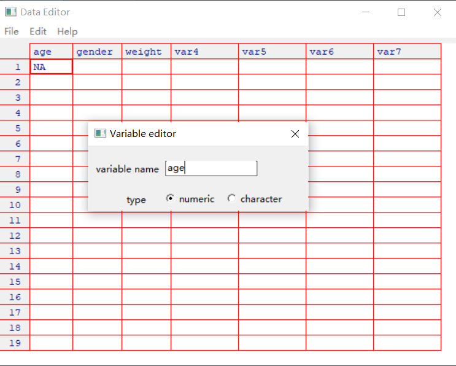

# 2 R 语言基础操作

数据分析首先需要把数据输入或导入为特定的格式，即保存为特定的数据结构。本章首先介绍 R 中的5种基础数据结构：向量、矩阵、数组、数据框、列表以及两种特殊的数据类型：因子和 tibble。此后简单介绍向 R 中导入外部数据的多种方法，并罗列了 R 中处理数据的基础函数。近年来有多种支持导入多种数据的包，可在掌握基础方式后再行了解。

## 2.1 数据结构基础 

R 中储存和操纵的实体（entity）可统称为对象（object），其基础数据类型包括向量（vector）、矩阵（matrix）、数组（array）、数据框（data frame）和列表（list），也可包括由这些实体定义的更一般性的结构（structures）。实体、对象和结构，以及 R 说明文档中经常涉及的“类”、“S3”、“S4”等，都是抽象的计算机术语，初学者可暂不必过分在意其“本质定义”，仅从功能性或操作性的视角加以理解即可。为便于理解，这里未从计算机程序语言的角度严格区分数据结构（data stucture）和数据类型（data type）这两个概念。其实，R 的开发者也未对两者之间的定义做出明确区分，并多用“数据结构”一词指代一般计算机程序中的“数据类型”，用于说明 R 中数据的储存形态、提取方式及相关的指定操作。因此，在本书中暂可将两者等同看待。

### 2.1.1 对象与赋值

新引入的对象通常需要进行赋值（assign），即给对象“取名”。R 中规范的对象赋值符号使用箭头符号`<-`或`->`，但后者比较少用。箭头实际上表示赋值的方向，箭头所指处通常为对象名。例如

```
x <- rnorm(10, mean = 0, sd = 1) 
x
```

第一行语句表示生成10个服从标准正态分布$N(0, 1)$的随机数，并将其赋值为`x`，即储存为数据对象`x`。仅执行第一条语句并不能直接在 R 的控制台显示这一对象本身，需要像第二行那样输入对象名让 R 去调用这一对象，从而进行展示。由于是随机生成的，故重复这一代码会产生不同的结果。如想使结果具有可重复性，可使用`set.seed()`函数设定随机数种子数（seed），相同的种子数总会产生相同的结果，但这一结果仅对`set.seed()`之后的第一条命令适用。

```
set.seed(1234)
y <- rnorm(10, mean = 0, sd = 1) 
y
```

注意上述命令中的参数（parameter）`mean = 0, sd = 1`其实可以省略，即写成`rnorm(10)`；或者写成`rnorm(10, 0, 1)`也可。因为`rnorm()`函数默认的参数取值与顺序就是如此。除非要设定其他均值或标准差，否则没有必要申明参数取值。

使用`ls()`函数可查看当前环境中的所有已赋值对象。`ls`是 list 的缩写。

```
ls()
```

而要移除（remove）某一对象，可使用`rm()`命令，`rm`是 remove 的缩写。

```
rm(x, y)
```

如要移除所有对象，可使用命令

```
rm(list = ls()) # 移除所有对象
ls() # 显示空对象时的结果
```

`#`号表示注释，注释掉的内容不会作为程序执行。结果显示`character(0)`，即不存在任何对象。`rm(list = ls())`经常用在新建某个工作任务的时候。若该任务未完成，要谨慎使用这一命令，否则会移除所有前期工作结果。

一般意义上，R 中最常见的基础数据类型包括：

* 数值型（numeric），又可分为整型（integer）和双精度型（double）
* 逻辑型（logical），取值只能为真（`TRUE`）或假（`FALSE`）
* 字符型（character），夹在双引号（`""`）或单引号（`''`）之间的字符串（string）

此外还有一些特殊符号表示数据对象的特殊取值。

* `Inf`，表示无穷大（infinity），负无穷大表示为`-Inf`。如输入`1/0`即可显示`Inf`。
* `NA`，缺失值（not available）。
* `NaN`，表示不确定（not a number），如`0/0`的结果即是`NaN`。
* `NULL`，表示意义为空的对象。

要注意对包含`NA`值的变量施加任何运算，结果均为`NA`。

```
z <- c(1, 2, 3, NA)
mean(z)
```

上述第一行命令生成一个由数字1、2、3和缺失值`NA`四个元素构成的数列（数值向量）。第二行命令表示对这一数据求均值（mean）。结果返回为`NA`，这是因为`z`中存在缺失值。若想在计算时剔除缺失值，仅对有具体取值的对象进行计算，可将`mean()`函数（及其他类似函数）中的`na.rm = `参数设定为`TRUE`。

```
mean(z, na.rm = TRUE)
```

下面具体介绍 R 中的基础数据结构，并在此基础上介绍 R 中两种特殊的数据结构：因子（factor）与 tibble。

### 2.1.2 向量

向量（Vector）是 R 中最简单的数据结构，它通常用来存储数值型（numeric）、字符型（character）或逻辑型（logical）数据，且一个向量只能存储一种类型的数据。向量使用`c()`函数进行创建，其中`c`表示 concatenate（联结、串联），或者 combine。R 中不存在“标量”（scalar），单个数字或字符串等所谓的标量其实是只含一个元素的向量。

```
vector_num <- c(1, 2, 3)  # 创建数值型向量
vector_char <- c("one", "two", "three")  # 创建字符型向量
vector_log <- c(T, TRUE, F, FALSE) # 创建逻辑型向量
```

其中

* `<-`表示赋值
* 字符型向量中的元素应放在引号（`""`或`''`）中
* `T`与`F`是逻辑型数据`TRUE`与`FALSE`的缩写。多数情况下，`T`与`TRUE`、`F`与`FALSE`分别等价，故定义变量名时尽量不要使用这`T`和`F`这两个大写字母。但从规范性出发，宜尽量不要用缩写表示逻辑型数据。
* `c(1, 2, 3)`与`c(1:3)`等价。还可使用类似`vector_num <- 1:5`的简化命令，但更推荐规范的创建方式。

使用`vector_name[]`的形式可调用向量中的元素，`[]`中填入表示元素位置的整数。

```
vector_char <- c("one", "two", "three")
vector_char[2]
vector_char[2:3]
vector_char[c(1, 3)]
```

以上三种方式分别调用`vector_char`向量的第2个元素、第2到第3个元素、第1和第3个元素。

在 R 中，向量的长度（length）是指其所包含的元素个数，这可用函数`length()`判定。

```
length(vector_char)
```

可使用`is.numeric()`、`is.character()`、`is.logical()`命令来判断向量是否为指定类型。

```
is.numeric(vector_num)
is.character(vector_char)
is.logical(vector_log)
is.numeric(vector_char)
```

向量是 R 数据结构的基础。R 中的诸多函数都是向量化（vectorization）的，即对向量施加的运算会作用于该向量的每一个元素。前面命令中的`y <- x / 5`已经体现了向量化运算的实质。以下是其他示例。

```
x <- c(1:10)
x + 100
sqrt(x) 
y <- c(3:1)
x > y
pmax(x, y)
```

其中

* `sqrt()`表示求算术平方根（square root）
* `x > y`给出逻辑向量，最左起第一个向量开始比较，检测相同位置上`x`中的元素是否大于`y`中的元素。
* `pmax(x, y)`给出一个与所给向量中最长向量长度相等的向量，向量中的元素由相同位置所在向量的最大值组成，类似的还有`pmin()`,含义可自推。可尝试运行并修改以下内容,解释结果：

```
pmin(c(1:3),c(3:1),c(1,2,3))
pmin(c(1:3),c(3:1),c(3,2,1))
```

从中不难理解为什么 R 要求向量中的元素必须具备同样的模式，否则就无法进行向量化的运算。

另外，R 中的对象名称可以重复定义，最近一次赋值的对象会覆盖（即替换）原有对象，且不会有弹窗提醒。例如

```
x <- c(1:10)
x 
x <- c(10:1)
x
x <- x + 1
x
```

尤其要注意`x <- x + 1`这种赋值方式。这在传统数学意义上并不常见，但在计算机程序中却很常用，`<-`不妨理解一个箭头，代表着赋值的方向。如果不想覆盖原对象，最好将运算后的对象赋值为新的对象名。

### 2.1.3 矩阵

矩阵（Matrix）是仅包含同质数据的二维数据结构，可理解为许多同类型、等长度向量的组合。矩阵使用`matrix()`函数创建。

```
matrix_01 <- matrix(1:6, nrow = 2, ncol = 3)
matrix_01
```

其中`nrow =` 参数用于设定行数（number of rows），`ncol =` 参数用于设定列数（number of columns）。两者确定一个，即可确定矩阵的形式。

从`matrix_01`的结果可看出，`matrix()`函数中默认是以“按列填充”的方式排列数据的。若要按行填充，则可使用`byrow = TRUE`参数。

```
matrix_02 <- matrix(1:6, nrow = 2, byrow = TRUE)
matrix_02
```

还可通过如下方式设置矩阵的维度名称，以增强矩阵的可读性。

```
cells <- c(1:6)
row_names <- c("R1", "R2", "R3")
col_names <- c("C1", "C2")
matrix_03 <- matrix(cells, nrow = 3, byrow = TRUE, dimnames = list(row_names, col_names))
matrix_03
```

另可通过`dim()`函数对向量添加维度（dimention）属性创建矩阵。

```
vector_matrix <- c(1, 3, 5, 7, 9, 11)
dim(vector_matrix) <- c(3, 2)
vector_matrix
```

可使用`matrix_name[,]`的方式调用矩阵中的元素，逗号前填入行数，逗号后填入列数，若这两个位置中某个位置留空，则表示选择整行或整列数据。

```
matrix_04 <- matrix(1:8, nrow = 4)
matrix_04
matrix_04[2, ]
matrix_04[, 1]
matrix_04[4,2]
matrix_04[c(1, 3), 2]
```

最后一行命令使用了`c(1, 3)`的方式指定了多个不同行。

### 2.1.4 数组

数组（Array）是矩阵的拓展形式，同样只能存储同质数据，但可有2个以上维度。数组使用`array()`函数创建。这种形式的数据结构在初学期较少遇见。

以下命令可创建 $3 \times 2 \times 2$、且各维度均有命名的数组，并填充数字1到12。

```
dim1 <- c("a1","a2","a3")
dim2 <- c("b1","b2")
dim3 <- c("c1","c2")
array_01 <- array(1:12, c(3, 2, 2), dimnames = list(dim1, dim2, dim3))
array_01
```

同样也可通过对向量添加`dim()`属性来创建数组。

```
vector_array <- c(1, 3, 5, 7, 9, 11, 13, 15)
dim(vector_array) <- c(2, 2, 2)
vector_array
```

数组中元素的调用方式与矩阵类似，可以`array_name[,,]`形式调用。

```
array_01[1, , ]
array_01[2, 1, ]
array_01[, , 2]
array_01[1, 1, 1]
```

### 2.1.5 数据框

数据框（Data Frame）是 R 里应用最多的数据结构，能存储不同类型的数据，可视为许多等长度（但类型可不相同）向量的组合，也可视为解除了存储数据类型限制的矩阵。数据框使用`data.frame()`函数创建。

以下命令可在 R 中创建一个学生信息数据框。

```
student_id <- c(1:4)
student_name <- c("a001", "a002", "a003", "a004")
male <- c(TRUE, TRUE, FALSE, FALSE)
student_data01 <- data.frame(student_id, student_name, male)
student_data01
```

可通过`row.names =` 参数设定行标志符（case identifier），即把每行的名称等同于某列中对应行的元素取值。试比较如下命令创建的`student_data02`与`student_data01`的显示结果。

```
student_data02 <- data.frame(student_id, student_name, male, row.names = student_name)
student_data02
```

当两个数据框行数相同时，可使用`cbind()`进行列合并（bind columns），也可使用此函数将独立的向量合并到数据框中；当两个数据框列数相同且列名一一对应时，可使用`rbind()`进行行合并（bind rows）。

先看`cbind()`的示例。

```
age  <-  c(18, 18, 17, 16)
cbind(student_data01, age)
```


再看`rbind()`的示例。

```
rbind(student_data01, data.frame(student_id = 5, student_name = "a005", male = TRUE))
```

上例中临时创建了未命名的数据框，将其合并到了已有数据框`student_data01`中。

在数据框内，列表示变量名（variables），行表示观测值（observations）。此后行文中，列与变量、行与观测分别同义，可替换使用。

与矩阵类似，可使用`dataframe_name[,]`的形式来读取数据框中的元素。

```
student_data01[2:3]
student_data01[1, ]
student_data01[, 1]
student_data01[1, 2]
```

也可使用美元符号`$`提取数据框中的列。

```
student_data01$student_id
student_data01$male
```

还可使用双方括号`[[]]`（通常也简写成`[[`）的形式提取元素。使用`[[]]`时，首先提取数据框中下一层级的元素（即列），还可在`[[]]`后附加`[]`提取再下一层级的元素（即向量中的基础元素）。请看下例。

```
student_data01[[2]]
student_data01[[2]][3]
```

`[[]]`的链式提取功能可便于复杂数据结构中的元素提取。

在某些时候，使用绑定函数`attach()`和解绑函数`detach()`可以让命令变得简单。绑定后可省略数据框名进行框内数据访问。若同时绑定多个数据框，涉及重名的变量以最近一次绑定的数据框中的变量为准。在真实的数据处理中，应避免过多使用这种方式绑定数据框。

```
attach(mtcars)
mpg
detach(mtcars)
```

如果未绑定`mtcars`数据框，则会出现如下错误提示：

```
mpg
Error: object 'mpg' not found
```

另外，可使用`with()`和`within()`绑定数据框，前者只可绑定但不可修改数据框，后者则可绑定并修改的数据框。

```
with(data, {expr, ...})
within(data, {expr, ...})
```

使用`with()`命令时，左括号`(`后写入数据框名，待实现的命令需放在`{}`中，可分行写入不同命令。注意此时一般应保存命令结果或使用`print()`输出单行命令的结果，否则默认输出最后一行命令。

```
with(mtcars, {
  print(summary(mpg))
  plot(mpg, wt)
})
```

其中

* `summary()`函数用于输出变量的描述统计结果，分别是（括号中为输入结果中对应的英文）最小值（`Min`）、第一四分位数（`1st Qu`）、中位数（`Median`）、均值（`Mean`）、第三四分位数（`3rd Qu`）和最大值（`Max`）。
* `plot()`函数用于绘制两个变量之间的散点图（scatterplot）。

试比较：

```
with(mtcars, {
  summary(mpg)
  plot(mpg, wt)
})
```

此时结果中并没有输入`summary(mpg)`的结果。

`within()`命令的用法与`with()`类似，但可修改数据框，但应注意保存操作结果。

```
mtcars_new <- within(mtcars, {
  high <- NA
  high[mpg >= median(mpg)] <- TRUE
  high[mpg < median(mpg)] <- FALSE
})
```

* `high <- NA`命令在`mtcars`数据框中新生成一个变量，先将其赋值为缺失值（`NA`）
* `high[mpg >= median(mpg)]`这种方括号的用法在 R 的数据框操纵中非常常见，在此`[]`表示特定的条件。若其对应的`mpg`大于等于中位数，则将`high`赋值为`TRUE`；反之赋值为`FALSE`。

最后可用`head()`命令观察增加新变量的数据框的前 6 行。

```
head(mtcars_new)
```

此例实际上给出了 R 中为指定数据框新增变量的基本方法。

### 2.1.6 列表（List）

列表是 R 中最复杂的数据类型，可包含任何类型的数据，包括向量、矩阵、数组、数据框，还可嵌套包含其他列表，各成分的元素性质与长度可不统一。列表使用`list()`函数创建，并可以为列表内项目命名。

```
a <- c(1:3)
b <- matrix(1:6, c(2, 3))
c <- array(1:12, c(2, 2, 3))
d <- student_data01
list_01 <- list(name_01 = a, name_02 = b, name_03 = c, name_04 = d)
```

上述命令创建了包含向量、矩阵、数组和数据框的列表，并将列表中下一层级的数据分别命名为 `name_01`至 `name_04`。

```
list_01
```

列表同样可使用`[[`或`$`符号进行内部元素的提取。

```
list_01[[2]]
list_01[[2]][2]
list_01$name_01
```

在知道列表内部元素的命名时，使用`$`提取是较为方便的。否则，使用双方括号的形式提取可能更有通用性。

使用`str()`可展示列表（及其他数据类型）的结构。

```
str(list_01)
```

通过这一命令可了解某些复杂结构的数据对象。以下命令给出了`mtcars`数据中以`wt`为自变量，建立`mpg`与`wt`之间的一元线性回归方程模型后，R 中保存的拟合模型（此处命名为`fit`）的数据结构信息。

```
fit <- lm(mpg ~ wt, data = mtcars)
summary(fit)
str(fit)
```

`str(fit)`的具体内容此时暂不必深究，仅供了解数据结构使用。R 中诸多统计模型的命令结果均储存为列表，若要提取其中某些元素，宜先用此命令检视其数据结构。


### 2.1.7 因子

一般数据分析中称为类型变量（categorical data）的数据 ，在 R 中都以因子（Factor）的形式储存。类型变量依测量水平高低又可分为定类（nominal level，又译称名尺度）和定序（ordinal level，又译顺序尺度）两种类型，前者只有类别属性之分，如通常意义上的颜色（非光谱学意义上）、性别、种族等，后者则有程度大小之别，如年级、以优良中差等方式标注的等级成绩，以及以满意、中立、不满意等方式呈现的满意程度等。前者可称为无序因子，后者可称为有序因子（ordered factor）。

抽象地讲，因子是建立在整型（integer）向量基础上、只能包含预先定义数值的向量，它具有不同的水平（levels），用于表示因子的所有可能取值。因子和水平的翻译，已经熟悉实验设计或方差分析的用户应该并不陌生，但对完全不熟悉相关统计方法的用户可能需要适应这种翻译生硬、但又约定俗成的做法。因子可使用`factor()`函数创建，其用法如下

```
factor(x, levels = , labels = levels, ordered = , ...)
```

其中

* `x`表示待因子化的向量
* `levels`表示因子的取值（水平）
* `labels`表示因子的取值标签（默认等同于因子水平本身）
* `ordered`用于设定有序因子
* 其他参数请使用`?factor`命令查看

以下通过示例说明`factor()`函数的用法。

```
factor_01 <- factor(c("male", "female", "male", "female"))
factor_01
mode(factor_01)
as.numeric(factor_01)
levels(factor_01)
```

从结果中可看出，R 自动将因子`factor_01`存储为向量`(1, 2, 2, 1)`的形式，其中`female = 1`, `male = 2`，这实际是按变量取值的字母序进行赋值，即确定其水平的排序。使用`levels()`命令可查看因子型数据的具体取值。`mode()`命令详见下文。

若要指定因子水平的特定顺序（非字母序）时，可使用`factor()`中的`levels = `参数进行设定。

```
factor_02 <- factor(c("male", "female", "male", "female"), levels = c("male", "female"))
levels(factor_02)
```

针对定序数据，可能需要指定因子的取值排序，使之成为有序因子。此时需使用参数`ordered = TURE`加以设定。

```
grade_01 <- factor(c("freshman", "sophomore", "junior", "senior"))
levels(grade_01)
as.numeric(grade_01)
grade_02 <-
  factor(
    c("freshman", "sophomore", "junior", "senior"),
    levels = c("freshman", "sophomore", "junior", "senior"),
    ordered = TRUE
  )
levels(grade_02)
as.numeric(grade_02)
```

对于数值型向量，进行因子化时可采用`labels`参数进行设置。

```
gender <- c(1, 0, 0, 1)
gender_factor <- factor(gender, levels = c(0, 1), labels = c("female", "male"))
gender_factor
levels(gender_factor)
```

需要说明的是，R 在读入外部数据并转为数据框的过程中，默认将所有字符型变量转化为了因子数据加以储存。这对于早期的计算机具有节约内存的效果，但对当下的计算机硬件性能而言，这种优势已几乎不复存在。因此，许多后起的 R 包在读入外部数据，不再默认对字符型变量进行因子化，具体宜参考其说明文档加以识别。

### 2.1.8 tibble

`tibble` 并不是 R 自有的数据类型。它是 Hadley 等人在数据框函数`data.frame()`基础上衍生的一种扩展性数据框。它本质就是一种数据框，但在显示形式上更加人性化，应用更加方便，可存储任意类型数据。`tibble` 暂无明确的中文翻译，这里直接使用英文（通常缩写为 tbl）。此类型数据依赖于 **tibble** 包（需自行安装），可使用其中`tibble()`函数创建。向量、矩阵和数据框均可通过`as_tibble()`函数转换为 `tibble`。

以下示例假定已安装 **tibble** 包或 **tidyverse** 包。

```
library(tibble)
tbl_01 <- tibble(x = 1:5, y = letters[1:5])
tbl_01
```

可以看到 `tibble` 类型的数据框列名下标示出此列数据类型的缩写，这是它不同于传统数据框的一个特征。同时，在显示 `tibble` 时，首先给出该 `tibble` 的维度（行数 $\times$ 列数）。`tibble` 定义了7种数据类型的缩写：`int`（integer，整型）、`dbl`（double，双精度）、`chr`（character ，字符型）、`dttm`（date + time，日期 + 时间）、`lgl`（logical，逻辑型）、`fctr`（factor，因子）、`date`（日期）。

对于较长的数据框，`tibble` 默认只显示前10行（相当于`head(x, 10)`的效果），并给出剩余的行数；其显示的列数则视显示窗口的大小而自动调整。这有利于简洁列示大型数据框的基本信息。

```
mtcars_tibble <- as_tibble(mtcars)
mtcars_tibble
```

再看一个较大的数据框，以`cgss2013.dta`为例 ^[`cgss2013`是中国综合社会调查（Chinese General Social Survey，CGSS）2013年数据的简称，数据储存为`.dta`格式，即 Stata 格式。中国综合社会调查始于2003年，是我国最早的全国性、综合性、连续性学术调查项目。该系列数据可从[CGSS官网](http://www.chinagss.org/)注册后下载。]进行。这里使用 **haven** 包中的`read_dta()`函数读入。读入后自动转为 `tibble`。

```
library(haven)
cgss2013 <- read_dta("cgss2013.dta")
length(names(cgss2013))
```

`names()`用于列示数据框中的所有变量名，`length()`用于显示其长度，即变量个数。结果显示有722个。若将所有变量与数据进行展示，无疑会占据很大的屏幕空间，多数情况下不是必要的。`tibble` 可根据屏幕宽度自动调整，并只显示前10行，然后给出相关信息。

```
cgss2013
```

`tibble` 本身即是数据框，但具有普通数据框不具备的特征；然而又不是所有的数据框都是 `tibble`。这一点从以下命令中可以看得很清楚。

```
is.data.frame(mtcars_tibble)
is_tibble(mtcars_tibble)
is_tibble(mtcars)
```

其他关于 `tibble` 的更详细特征，可参见其说明文档：

<https://cran.r-project.org/web/packages/tibble/vignettes/tibble.html>

## 2.2 读写外部数据

R 很少作为一个数据输入软件，通常只作为一个数据分析软件。这里简单介绍在 R 中直接输入数据的方式，重点在于说明如何导入外部数据。限于本书的篇幅与定位，这里仅说明如何导入常用的、且以数据框形式存在的数据。

导入这些外部数据通常需要安装其他相关 R 包。常用的包有：

* **foreign** 包，R 默认安装，可导入 SPSS、Stata、SAS 格式的数据
* **Hmisc** 包，可导入 SPSS、Stata、SAS 格式的数据
* **openxlsx** 包，可导入 Excel 格式数据
* [Hadley](http://hadley.nz/) 开发的 R 包，如 **haven** 等，可导入各类数据
* **sas7bdat** 包，可导入 SAS 格式数据
* **memisc** 包，可导入 SPSS、Stata 格式数据

这里择要进行介绍。以下假定读者已安装各相关 R 包。

### 2.2.1 直接输入数据

使用 R 内置的文本编辑器，可以弹出类似 Excel 的数据输入的朴素界面，通常在数据较少时使用。R 中的函数 `edit()` 会自动调用一个可手动输入数据的文本编辑器。步骤如下：

* 创建一个空数据框（或矩阵），其中变量名和变量的模式要与理想中的最终数据集一致

* 针对此数据对象调用文本编辑器，输入数据并将结果保存回此数据对象中

例：创建一个名为`data`的数据框，它含有三个变量：`age`（数值型）、 `gender`（字符型）和`weight`（数值型）。

```
data <- data.frame(age = numeric(0), gender = character(0), weight = numeric(0))
data <- edit(data)
```

调用 `edit()` 函数后结果如图2.1。



* 单击列的标题，可以修改变量名与变量类型
* 单击未使用的标题可以添加新的变量
* 编辑器关闭后，结果会保存到之前赋值的对象中。

应注意 `edit()` 是在数据对象的副本上进行操作的。若未将其赋值到到原有对象中，所有修改并不会自动保存。如想直接在原始对象中修改并保存，可使用`fix()`命令，它同样可弹出数据编辑窗口，修改后直接保存至原数据对象。

### 2.2.2 导入文本格式数据

**`read.table()`函数**

纯文本文档数据，可用 `read.table()` 函数，语法如下

```
file <- read.table("xxx.txt", header = , sep = "", ...)
```

其中

* `xxx.txt`表示待读取的文件名
* `header = TRUE`表示将数据第一行读为变量名（默认选项），`header = FALSE`表示不将数据第一行读为变量名，若数据无变量名，则会自动以V1、V2等依次来命名
* `sep = ""`表示分隔符，引号中可填入空格（即`""`，两个引号之间有一个英文空格）、回车符（`\r`）、换行符（`\n`）、制表符（`\t`）等
* `...`表示其他参数，具体可使用`?read.table()`查询

**`read.delim()`函数**

类似的函数还有`read.delim()`，语法如下

```
read.delim(file, header = TRUE, sep = "\t", ...)
```

在`sep =` 后输入其他符号，可以导入不同分隔符的文本数据。

**`scan()` 函数**

读取数据时，`scan()` 函数可以指定输出变量的数据类型，输出形式可以是向量、矩阵、数据框、列表等。语法如下

```
scan(file = "", sep = "", ...)
```

其中

* `file` 表示文件名(在`""`之内)
* `sep = ""`用于指定分隔符
* 有关其他参数说明，请参考 `?scan()`

**`read.csv()`函数**

`csv`文档可理解为特殊格式的`txt`文档，其后缀名为`.csv`，意为逗号分隔值（comma separated values），是常见的通用文件格式，也是跨系统储存数据时的最常见文件格式之一。它可直接使用`read.csv()`函数读取，语法如下

```
file <- read.csv("xxx.csv", ...)
```

其中，

* `xxx.csv`表示待读取的文件名
* `...`表示其他参数，形式同`read.table()`函数，具体也可使用`?read.csv()`查询

### 2.2.3 导入 Excel 格式数据

对已安装 Office 软件的用户，推荐先将 Excel 文件导出为csv文件，再使用`read.csv()`导入。如想直接导入 Excel 格式数据，通常需要安装相关 R 包。

如果已经安装了 Java 环境的用户，传统上可通过安装 **xlsx** 包来导入 Excel 数据。对 Windows 用户，Java 环境并非默认安装，需自行下载安装，稍显繁琐。现在，也可使用 **openxlsx** 包中的`read.xlsx()`函数来实现同样功能，此包无须安装 Java 环境，值得推荐。用法如下

```
library(openxlsx)
file <- read.xlsx("xxx.xlsx", sheet = 1)
```

其中， `sheet = 1`表示读入第一个表单的数据，可通过输入不同数字或表单名来指定要读入的表单。

### 2.2.4 导入 SPSS 格式数据

通过 **foreign** 包中的`read.spss()`函数可以导入相关文件，**foreign** 包已默认安装，但使用时仍需调用。

```
library(foreign)
file <-
  read.spss("xxx.sav",
            use.value.labels = TRUE,
            to.data.frame = FALSE,
            ...)
```

其中，

* `xxx.sav`表示文件名
* `file, use.value.labels = TRUE`表示默认读入原始文件中的标签
* `to.data.frame = FALSE`默认不将数据读为数据框而是列表，一般宜设置成`to.data.frame = TRUE`

**Hmisc** 包中的函数 `spss.get()` 导入 SPSS 格式数据时，默认转为数据框。

```
libiary(Hmisc)
file <-
  spss.get("xxx.sav",
           use.vaule.labels = TRUE,
           to.data.frame = TRUE)
```

### 2.2.5 导入 Stata 格式数据

* **导入 Stata 12 及以下数据**

**foreign** 包中的`read.dta()`函数可导入 Stata 12 及以下版本的数据，语法为

```
library(foreign)
read.dta("xxx.dta")
```

但对 Stata 13 及以上版本，此函数无效。

* **导入 Stata 13及以上数据**

使用 **readstata13** 包中的函数`read.dta13()`，语法如下

```
read.dta13("xxx.dta", convert.factors = TRUE, ...)
```

有关 **readstata13** 包中其他函数以及有关各函数的参数说明请点击[这里](https://cran.r-project.org/web/packages/readstata13/readstata13.pdf)

### 2.2.6 Hadley 函数

Hadley Wickham开发的系列R包可灵活方便导入上述各种数据 ：

* **readr** 导入csv、fwf 数据
* **readxl** 导入 Excel数据(包括.xls和.xlsx型)
* **haven** 导入SAS,SPSS,and Stata数据
* **httr** 导入网页API(Application Programming Interface,应用程序编辑接口)数据
* **rvest** 网页数据抓取
* **xml2** 导入 XML文件

此处择要介绍，更多信息参见网页(http://hadley.nz/)：

* **readr 包中的函数**

**readr** 包提供诸多读取文本数据的函数，比 R 自带的函数一般而言速度更快，且直接转换为 tibble，而不是 data frame。其中几个主要的分别如下：

* 读取含有分隔符文件：
* `read_delim(file, delim, ...)` ：可以指定分隔符的数据文件
* `read_csv(file, col_names = , ...)` ：读取逗号分隔的数据文件
* `read_tsv(file, col_names = , ...)` ：读取制表符分割的数据文件
* `read_table(file, col_names = , ...)` ：读取空格分隔的数据文件
* `read_fwf(file, col_positions, ...)`：读取固定宽度文件
* `read_log(file, col_names = , ...)`：读取日志文件
* `read_lines(file, skip = , ...)`：从文件中逐行读取数据
* `read_table()`：读取表格文件

更多有关readr中的这些函数参数说明请点击[这里](https://cran.r-project.org/web/packages/readr/readr.pdf)

* **readxl 包中的函数**

**readxl** 包提供了一些在 R 中读取 Excel 表格数据的函数（`.xls` 和 `.xlsx` 格式）。

`read_excel()` 函数用来读取 `.xls/.xlsx` 文件。语法如下

```
read_excel("xxx.xls", sheet = )
read_excel("xxx.xlsx", sheet = )
```

其中，

* `xxx.xls`、`xxx.xlsx`表示文件名
* `sheet` 表示 Excel 文件中表单号，默认为1
* 有关 **readxl** 包详细内容请点[这里](https://mran.microsoft.com/web/packages/readxl/readxl.pdf)

* **haven 包中的函数**

**haven** 包提供了读取 SPSS, SAS 和 Stata 统计软件格式数据的函数，分别如下

* `read_sas("xxx.sas")`：读取 SAS 数据
* `read_sav("xxx.sav")`：读取 SPSS 数据
* `read_dta("xxx.dta")`：读取 Stata 数据
所有读入的数据自动转为 tibble 格式。

### 2.2.7 R 数据导出

一般只推荐导出为`.csv`等通用型的数据。使用 `write.csv()` 将数据导出为 `.csv` 文件。

```
write.csv(prac01, "prac01.csv")
```

`csv` 文件选择 Excel 打开另存为后即可导出 Excel 文档。

使用 **haven** 包中的`write_sav()`、`write_dta()`和`wirte_sas()`函数分别可导出为 SPSS、Stata 和 SAS 格式的数据，使用简单明了，这里不再说明。

## 2.3 实用基础命令

R 内置诸多功能丰富的基础函数，使用这些函数不需要先加载任何包，启动 R 后即可运行。这里粗略地分为数学函数、统计函数、向量计算函数、概率函数、逻辑与集合函数、类型判断与转换函数、日期格式函数、帮助函数、工作目录与工作空间函数、`apply()`族函数等类别进行介绍，并首先介绍了基本的算术运算符和逻辑运算符。部分函数的分类可能有所重叠。R 本身内置的文本数据分析函数、即字符串处理函数（string functions），将在介绍 **stringr** 包时再行介绍。

如无特殊说明，以下举例中的`x`、`y`等均指向量。各函数用法在解释其基本功能后，易于理解者不再举例，复杂者再行举例说明。部分专业术语给出英文，方便记忆与对照。初学者宜花一定时间，尝试以下所有函数，以熟悉 R 的命令模式与函数风格。

如需了解更多 R 基础函数，可输入如下命令

```
help(package = "base")
```

### 2.3.1 算术运算符

| **运算符** |	**功能** |
|   :----:   |   :----:  |
| `+` | 加/求和（sum）|
| `-` |	减/求差（difference）|
| `*`	| 乘/求积（product） |
| `/` |	除/求商（quotient）|
| `^或**` |	求幂（乘方，power），如`5 ** 2`的结果为`25` |
| `x %% y` |	求余运算，如`5 %% 2`的结果为`1` |
| `x %/% y` |	整除运算，如`5 %/% 2`的结果为`2`|

### 2.3.2 逻辑运算符

| **运算符** |	**功能** |
|   :----:   |  :----:   |
| `<`  |	 小于   |
| `<=` | 小于等于 |
| `>`  |   大于   |
| `>=` | 大于等于 |
| `==` | 严格等于 |
| `!=` |  不等于  |
| `!x` |   非`x ` |
| `x | y` |	`x`或`y` |
| `x & y` |	`x`和`y` |
| `isTRUE(X)`	| 测试`x`是否为`TRUE` |

### 2.3.3 数学计算函数

| **函数名** | **功能** |
|   :----:   |  :----:  |
| `abs(x)` | 求绝对值（absolute value） |
| `sign(x)` |	求数字向量`x`中各元素的“符号”（正数为1，负数为$-1$，0仍为0），`sign(-2:2)`返回值为`-1 -1 0 1 1` |
| `sqrt(x)` |	求算术平方根（square root） |
| `max(x)` | 求`x`中元素的最大值 |
| `min(x)` | 求`x`中元素的最小值 |
| `sum(x)` | 求`x`中的元素之和，如`sum(1:5)`返回值为`15` |
| `prod(x)`	| 求`x`中元素的乘积（product意为乘积），如`prod(3, 4, 5)`返回值为`60` |
| `factorial()`	| 求阶乘（factorial），如`factorial(10)`返回值为`3628800` |
| `diff(x)`	| 求`x`中相邻元素之差 |
| `pmax(x, y)` | 求`x`，`y`在相应位置上元素的较大值 |
| `pmin(x, y)` | 求`x`，`y`在相应位置上元素的较小值 |
| `cummax(x)`	| 求累计最大值（从左向右），如`cummax(c(3:1, 2:0, 4:2))`返回值为 `3 3 3 3 3 3 4 4 4` |
| `cummin(x)`	| 求累计最小值（从左向右），如`cummin(c(3:1, 2:0, 4:2))`返回值为 `3 2 1 1 1 0 0 0 0` |
| `cummprod(x)` | 求`x`各元素的累积乘积值，如`cumprod(1:10)`返回值为 `1 2 6 24 120 720 5040 40320 362880 3628800` |
| `cumsum(x)` |	计算`x`各元素的累加值，如`cumsum(1:10)`返回值为 `1 3 6 10 15 21 28 36 45 55` |
| `ceiling(x)` | 求大于等于`x`的最小整数，如`ceiling(3.14)`返回值为`4` |
| `floor(x)` | 求小于等于`x`的最大整数，如`floor(3.14)`返回值为`3` |
| `trunc(x)` | 向0的方向截取`x`中的整数部分，如`trunc(5.99)`返回值为`5` |
| `round(x)` | 将`x`舍入（round off）为指定数位的小数，如`round(3.1415, digits = 2)`返回值为`3.14` |
| `signif(x)` |	将`x`舍入为指定数位的有效数字（significant figures），如`signif(3.1415, digit=2)`返回值为`3.1` |
| `choose(n, k)` | 求组合数，即 $C _n ^k$ 或 $ _n C _k $，如`choose(10, 2)`返回值为`45` |
| `sin(x)`,`cos(x)`,`tan(x)` | 求`x`的正弦值、余弦值、正切值 |
| `asin(x)`,`acos(x)`,`atan(x)`	| 计算`x`的反正弦、反余弦、反正切 |
| `sinpi(x)`,`cospi(x)`,`tanpi(x)` |	即为`sin(pi*x)`，`cos(pi*x)`，`tan(pi*x)`，如`sinpi(1/6)`返回值为`0.5` |
| `sinh(x)`	| 双曲正弦函数 $\sinh(x)$ |
| `cosh(x)` | 双曲余弦函数 $\cosh(x)$ |
| `tanh(x)` | 双曲正切函数 $\tanh(x)$ |
| `log(x, base=n)` | 对`x`取以 $n$ 为底的对数（logarithm） |
| `log(x)` | 对`x`取以自然底数 $\mathrm{e}$ 为底的对数 |
| `log10(x)` | 对`x`取以10为底的对数 |
| `log2(x)` |	对`x`取以2为底的对数 |
| `log1p(x)` | 即 $\log_{\mathrm{e}} (1 + x)$,对 $1 + x$ 取以 $\mathrm{e}$ 为底的对数 |
| `exp(x)` | 指数函数（exponential function），即 $\mathrm{e} ^ x$ |
| `expm1(x)` | $\mathrm{e} ^ x - 1$ |
| `integrate(f, lower, upper)`	| 求积分，`f`表示被积函数（integrand），`lower`表示积分下限，`upper`表示积分上限 |
| `D(fun, "x")`	| 求导函数，原函数`fun`通常使用`expression()`函数定义或直接输入 |
| `eval(D(fun, "x"))` | 求（设定`x`值后）指定点处的导数值，`eval`表示evaluate（计算） |

### 2.3.4 统计计算函数

| **函数** | **功能** |
| :----:   |  :----:  |
| `mean(x)`	|求均值，如`mean(c(1, 3, 5, 7))`返回值为`4` |
| `median(x)` |	求中位数，如`median(c(1, 3, 5, 7))`返回值为`4` |
| `range(x)` | 求最小值与最大值之差（range 在统计中常翻译为极差或全距，在数学中翻译为值域） |
| `IQR(x)` | 求`x`的四分位差（interquartile range） |
| `cor(x, y)`	| 求`x`、`y`之间的相关系数 |
| `sd(x)`	| 求标准差 （standard deviation，分母为 $n - 1$ ） |
| `var(x)` | 求方差（variance，分母为 $n - 1$） |
| `quantile(x, probs)` |	求分位数，`probs`为一个由[0,1]之间的概率值向量，如求`x`的30%和84%分位点为`quantile(x, c(0.3, 0.84))` |
| `scale(x, center = , scale = )` |	对`x`进行中心化（减去平均数，`center = T`）或标准化（减去平均数再除以标准差，`scale = T`） |

### 2.3.5 向量操纵函数

| **函数** | **功能** |
| :----:   |  :----:  |
| `length(x)` |	求`x`的长度，如`length(c(1, 2, 3, 4))`返回值为`4` |
| `seq(from, to, by)` |	以`by`为步长生成从`from`到`to`的等差数列，如`seq(1, 10, 2)`返回值为`1 3 5 7 9` |
| `rep(x, times = , each = , len = )` |	重复`x`，`times`控制向量整体的重复次数，`each`控制每个元素的重复次数，`len`控制输出长度 |
| `gl(n, k, labels = c() )` |	产生因子向量，其中`n`表示因子的水平数，`k`表示每一水平下的取值次数，`labels = c()`用于输入水平取值的标签 |
|`cut(x, n)` | 将连续型向量`x`分割为有着 $n$ 个水平的因子 |
| `pretty(x, n)` | 创建美观分割点。选取 $n + 1$ 个等距分割点，将连续型向量`x`分割为 $n$ 个区间 |
| `colSums(x)` | 求列总和，`x`为数值型矩阵、数组或数据框 |
| `rowSums(x)` | 求行总和，`x`为数值型矩阵、数组或数据框 |
| `colMeans(x)` |	求列均值，`x`为数值型矩阵、数组或数据框 |
| `rowMeans(x)` |	求行均值，`x`为数值型矩阵、数组或数据框 |
| `duplicated(x)` |	求向量或数据框的重复元素中的下标较小元素，并返回逻辑向量指出哪些元素重复 |
| `unique(x)` |	删除`x`向量、数据框或数组中重复的元素，如`unique(c(1, 2, 2, 4, 5, 4, 6))`返回值为`1 2 4 5 6` |
| `table()` |	制作频次表（frequency table）或列联表（contingency table） |
| `rev(x)` | 对`x`中元素取逆序（reverse order）排列 |
| `sort(x, decreasing = FALSE)` |	对向量`x`进行升序排序，若设置`decreasing = TRUE`则进行降序排序 |
| `order(x)` | 将`x`中元素下标按升序排列，如`order(c(20, 4, 13, 9))`返回值为`2 4 3 1` |
| `rank(x)` |	求秩（即排序位置），返回该向量中对应元素的大小位置排序，如`rank(c(20, 4, 13, 9))`返回值为`4 1 3 2` |

需要说明的是`rank()`与`order()`这两个“排序”函数之间的区别。`rank()`给出了向量的排序位置（默认从小到大），这在直觉上是易于理解的。然而`order()`函数的结果却有些晦涩。试看下例。

```
x <- c(20, 4, 13, 9)
rank(x)
```

至此并未有任何难解之处。麻烦在于理解`order()`的结果。

```
order(x)
```

如何理解结果中`2 4 3 1`与原向量`c(20, 4, 13, 9)`之间的对应关系呢？实际上，这里的`2 4 3 1`是指，若对原向量进行升序排序，则该向量中的第2个元素（4）应当排在第1位，第4个元素（9）应当排在第2位，第3个元素（13）应当排在第3位，第1个元素（20）应当排在第4位。也就是说，这里的`2 4 3 1`实际是标志着原向量中各元素的位置下标，并将其重新升序排列，表示第2个元素应当排在第1位，依次类推。这正是`order()`这一函数的本意：给出重新排列后，各元素应当具有的大小顺序关系，且这一顺序以原元素的位置下标予以体现。

比较如下两行命令，可更好地理解上面的说明。

```
x[order(x)]
sort(x)
```

两者结果相同。其实`x[order(x)]`的意思正是把`x`向量中的元素，按照其“应当出现的位置”（由`order(x)`提供）重新排列。

再看其在数据框的变量排序中的应用。

```
attach(mtcars) # 绑定数据框
mtcars[order(cyl), ]
```

这里的`order(cyl)`出现在行标的位置，意指让`cyl`（气缸数）最少者排在最前的行，逗号后留空表示所有其他列依前面的排序规则重新排序。

若要对多列取值进行排序，在`order()`中用逗号隔开即可，按括号中各列的先后次序进行排序。例如

```
mtcars[order(cyl, -mpg), ]
detach(mtcars) # 解绑数据框
```

另外，`colSums (x)`、`rowSums (x)`、`colMeans(x)`和`rowMeans(x)`这四个函数其实是一类，都是 R 向量化运算的一种体现，用于分行或分列求和或求均值。默认不移除缺失值，如需移除需对`na.rm = `参数加以设定（以`colSums()`为例）

```
colSums(x, na.rm = TRUE)
```

### 2.3.6 集合与逻辑函数

| **函数** | **功能** |
| :----:   |  :----:  |
| `intersect(x, y)` |	求`x`、`y`的交集（intersect） |
| `union(x, y)` |	求`x`、`y`的并集（union） |
| `setdiff(x, y)` |	求`x`、`y`的差集（`x - y`，要求`y`是`x`的真子集，否则结果显示零个元素） |
| `setequal(x, y)` | 判定`x`、`y`是否相等（所有元素相同） |
| `all()` |	给定一组逻辑向量所有值是否为真 |
| `any()` |	给定一组逻辑向量是否有一个值为真 |
| `which()` |	返回`x`为真值的位置下标，如`which(c(T, F, T))`返回值为`1 3` |
| `ifelse(cond, statement1, statement2)` |	若`cond`（条件）为真，则执行第一个语句；若`cond`为假，则执行第二个语句 |
| `%in%` | 匹配函数，详见说明 |
| `match(x, table)` |	匹配函数，详见说明 |

`%in%`是常用的匹配函数，其结果返回一组逻辑向量，`x %in% y`给出向量`x`中每个元素是否为向量`y`中的元素。`x`与`y`的长度不一定相同，但`x %in% y`结果向量的长度与`x`的长度相同。例如

```
x <- c(1:5)
y <- c(3:8)
x %in% y
y %in% x
```

`match()`的功能与此类似，但较不易理解。`match(x, y)`返回值为`x`各元素与y中相匹配的元素在`y`中的位置信息，没有相匹配的元素则返回NA。试看下例

```
x <- c(5, 2, 1, 4, 3)
y <- c(3:8)
match(x, y)
```

通常使用`%in%`函数更为便捷，也较易理解。

### 2.3.7 概率函数

此处所谓的概率函数并不是严格的定义，而泛指涉及概率计算的函数。R 中的概率函数包括四大类型

* `d`：密度函数（density function），给出密度函数值
* `p`：（累积）分布函数（distribution function），给出 $P(X \leqslant q )$ 的概率值，此处的p即表示概率（probability）
* `q`：分位数函数（quantile function），给出 $P(X \leqslant q) = p$的`q`值（分位数值），此时 $p$ 需要指定
* `r`：生成服从特定分布的随机数（random digits）
这四个字母加上不同的分布名称的缩写，即可完成相应的功能。例如

| **函数** | **功能** |
| :----:   |  :----:  |
| `dnorm(x, mean = , sd = )` |	给出指定正态分布的对应密度函数值 |
| `pnorm(q, mean = , sd = )` |	给出指定正态分布中 $P(X \leqslant q)$ 的概率值 |
| `qnorm(p, mean = , sd = )` |	给出指定正态分布中使得 $P(X \leqslant q) = p$ 的$q$值 |
| `rnorm(n, mean = , sd = )` |	给出 $n$ 个服从指定参数的正态分布随机数 |

下面以正态分布为例进行说明。

设$X \sim N(10, 2)$，求

* $P(X \leqslant 12)$
* $P(X \geqslant 13)$
* $P(9 < X < 12.5)$
* $P(X \geqslant q = 0.95)$，求 $q$

解法如下

* `pnorm(12, 10, 2)`，给出$P(X \leqslant 12)$的值，即`0.8413447`
* `1 - pnorm(13, 10, 2)`或`pnorm(13, 10, 2, lower.tail = FALSE)`，给出$P(X \geqslant 13)$ 的值，即`0.0668072`
* `pnorm(12.5, 10, 2) - pnorm(9, 10, 2)` 给出$P(9 < X < 12.5)$的值，即`0.5858127`
* `qnorm(0.95, 10, 2)`给出符合$P(X \leqslant q = 0.95)$的 $q$ 值，即`13.28971`

此处需要说明两点

* 对于连续型分布，从概率计算角度而言$P(a \leqslant X \leqslant b)$中的等于号是否取到不必计较
* `mean`和`sd`的字样可省略，直接输入数值；若在上述相关命令中不指定`mean`与`sd`，则默认为标准正态分布，即$N(0, 1)$

由此，生成10个服从标准正态随机数的命令如下

```
rnorm(10, 0, 1) # 或简单地 rnorm(10)
```

由于未设定随机数种子数，不同人演示的结果可能各不相同。

其他分布的概率计算与正态分布相似，只是在`d`、`p`、`q`、`r`后代入各自分布的名称即可。当然，命令中的具体参数需要参阅其帮助文档。

R 中概率分布名称的缩写如下

| **分布名称** | **缩写** |
|  :----:   |  :----:  |
|二项分布（binomial distribution） | `binom` |
|多项分布（multinomial distribution） |	`multinom` |
|正态分布（normal distribution） | `norm` |
|几何分布（geometric distribution） |	`geom` |
|超几何分布（hypergeometric distribution） | `hyper` |
|负二项分布（negative binomial distribution） |	`nbinom` |
|对数正态分布（log normal distribution） | `lnorm` |
|卡方分布（chi-squared distribution） |	`chisq` |
|F 分布 |	`f` |
|指数分布（exponential distribution） |	`exp` |
|Gamma 分布 |	`gamma` |
|Beta 分布 | `beta` |
|泊松分布（poisson distribution） |	`pois` |
|t 分布（student distribution） |	`t` |
|均匀分布（uniform distribution） |	`unif` |
|Logistic 分布 | `logis` |
|柯西分布（Cauchy distribution） | `cauchy` |
|Wilcoxon 符号秩分布 | `signrank` |
|Wilcoxon 秩和分布 | `wilcox` |
|Weibull 分布	| `wilbull` |

以下再以二项分布为例进行说明。若有随机变量 $X \sim B(10, 0.2)$，则

* `rbinom(5, 10, 0.2)`输出5个服从 $B(10 ,0.2)$ 分布的随机数，其格式为`rbinom(n, size, prob)`，其中`n`表示输出随机数个数，`size`表示二项试验的总次数，`prob`表示每次试验成功的概率。
* `dbinom(4, 10, 0.2)`求出 $P(X = 4)$ 的概率值，即 `0.08808038`
* `pbinom(4, 10, 0.2)`求出 $P(X \leqslant 4)$ 的概率值，即`0.9672065`
* `qbinom(0.9672065, 10, 0.2)`表示求出 $P(X \leqslant q) = 0.9672065$ 的$q$值，即`4`

其余不再一一举例。

### 2.3.8 数据对象操纵函数

| **函数** | **功能** |
|  :----:  |  :----:  |
| `length()` | 显示对象中元素的个数 |
| `dim()`	| 显示某个对象的维度 |
| `str()`	| 显示某个对象的结构 |
| `class()`	| 显示某个对象的类 |
| `mode()` | 显示某个对象的模式 |
| `names()` |	显示某对象中各元素的名称 |
| `head()` | 列出某个对象的开始部分 |
| `tail()` | 列出某个对象的最后部分 |
| `ls()` | 显示当前工作空间中的所有对象 |
| `rm(A, B, ...)` | 删除一个或多个对象，语句`rm(list = ls())`将删除当前工作环境中的所有对象 |
| `newobject <- edit(object)`	| 编辑对象并另存为新对象 |
| `fix(object)`	| 直接编辑对象，关闭后自动保存改动至原对象 |
| `cbind()`	| 根据列进行合并，要求所有的行数相等 |
| `rbind()`	| 根据行进行合并，要求所有的列数相等 |
| `rownames()` | 修改行数据框行变量名 |
| `colnames()` | 修改行数据框列变量名 |
| `exists()` | 寻找给定名称的 R 对象 |

### 2.3.9 类型判断与转换函数

| **判断** | **转换** |
|  :----:   |  :----:  |
| `is.numeric()` | `as.numeric()` |
| `is.character()` | `as.character()` |
| `is.vector()`	| `as.vector()` |
| `is.matrix()`	| `as.matrix()` |
| `is.data.frame()`	| `as.data.frame()` |
| `is.factor()`	| `as.factor()` |
| `is.logical()` | `as.logical()` |

### 2.3.10 日期函数

| **符号** | **含义** |	**示例** |
| :----: | :----: | :----: |
| `%d` | 数字日期（0~31） |	01~31 |
| `%a` | 缩写星期名 |	Mon |
| `%A` | 非缩写星期名 |	Monday |
| `%m` | 月份（00~12） | 00~12 |
| `%b` | 缩写月份 | Jan |
| `%B` | 非缩写月份 |	January |
| `%y` | 两位数年份 |	07 |
| `%Y` | 四位数年份 |	2017 |

### 2.3.11 帮助函数

| **函数** | **功能** |
|  :----:   |  :----:  |
| `help(package = "package_name")` |	输出某个包的简短描述以及包中所有函数与数据集列表 |
| `help.start()` | 打开帮助文档首页 |
| `help("xxx")`或`?xxx` |	精确搜索，查看函数`xxx`的帮助文档（引号可以省略） |
| `help.search("xxx")`或`??xxx` |	模糊搜索，以`xxx`为关键字搜索本地帮助文档 |
| `example("xxx")` | 函数`xxx`的使用示例（引号可以省略） |
| `RSiteSearch("xxx")` |	以`xxx`为关键字搜索在线文档和邮件列表存档 |
| `apropos("xxx", mode = "function")` |	列出名称中含有`xxx`的所有可用函数 |
| `data()` | 列出当前已加载包中所含的所有可用示例数据集 、
| `vignette()` | 列出当前已安装包中所有可用的 `vignette` 文档，即扼要说明文档 |
| `vignette("xxx")` | 以`xxx`为主题显示指定的 `vignette` 文档 |

### 2.3.12 工作目录与工作空间函数

| **函数** | **功能** |
|  :----:   |  :----:  |
| `getwd()` | 显示当前的工作目录 |
| `setwd()`	| 设定当前工作路径 |
| `install.packages()` | 下载和安装 R 包 |
| `update.packages()` | 更新已经安装的 R 包 |
| `load("")` | 读取 R 格式数据（`.RData`） |
| `library()` | 载入已安装的包 |
| `require()`	| 将会根据包的存在与否返回`TRUE`或`FALSE` |
| `options()`	| 显示或设置当前选项 |
| `save()` | 保存指定对象 |
| `q()` | 退出 R |
| `dir()` | 返回文件名、目录名或文件夹名称 |
| `dirname()`	| 返回路径中的目录部分 |
| `dir.creat()`	| 建立新目录 |
| `history()`	| 显示最近使用过的命令（默认值为25）|
| `savehistory()`	| 保存命令历史文件（默认为`.Rhistory`） |
| `loadhistory()`	| 载入一个命令历史文件（默认为`.Rhistory`） |
| `save.image()` | 保存工作空间到文件中（默认值为`.RData`） |
| `source()` | 执行包含在文件中的 R 语句命令集合 |
| `download.file()`	| 下载文件 |
| `file.path()`	| 拼接目录字符串 |
| `file.choose()`	| 返回可选择文件位置的对话框 |
| `file.copy()`	| 复制单个文件 |
| `file.create()`	| 返回创建的文件的句柄后，状态就是打开状态 |
| `file.remove()`	| 删除指定文件 |
| `file.rename()`	| 文件或目录的重命名 |
| `file.exists()`	| 检查文件或目录是否存在 |
| `file.info()`	| 查看当前或指定目录完整信息 |
| `.libPaths()`	| 能够显示库所在的位置 、

此处附加说明两个常用函数：`options()`和`require()`。

·options()·函数常用来设置 R 的结果显示，涉及的参数、功能及默认值很多，可用·?options·查看。这里只说明两个参数

* `digits =`，用于控制小数位
* `scipen =`，用于控制科学计数法（scientific notation）显示
先看`digits =` 的使用。

```
x <- rnorm(5)
x
options(digits = 3)
x
```

再看`scipen =` 的使用。其中`sci`表示科学计数法，`pen`表示`penalty`，通常译为惩罚因子，实质就是一个用于设定显示方式的临界值。`=`号后输入整数，超过此整数位则使用科学计数法，否则呈现所有数位。

```
factorial(20)
options(scipen = 100)
factorial(20)
```

`require()`函数也常用来加载 R 包，相当于`library()`。两者的不同在于，`require()`某个包之后，若发现未安装此包，则 R 会出现警告信息（warning message），但 R 仍将继续运行后续命令；而`library()`了某个不存在的包后，则会出现错误信息（error message），R 将停止执行后续命令。

例如

```
require(abcd)
```

试比较

```
library(abcd)
```

```
## Error in library(abc) : there is no package called ‘abc’
```

但有一种情况中，使用`require()`是比较方便的。

```
if (!require(dplyr)) install.packages("dplyr")
```

其含义是：若加载 **dplyr** 包时发现没有安装此包，则先行安装再加载。这对于不确定是否安装该包的用户进行代码演示时较为方便。

### 2.3.13 `apply`族函数

在 R 中，`apply`族函数`apply()`、`lapply()`、`sapply()`、`tapply()`等形式。前三者可将某一函数“应用”（apply）于矩阵、数组、数据框和列表的任一维度，`tapply()`则经常作用于因子数据以进行分组统计。

* **`apply()`**

`apply()`函数只能作用于数组或矩阵，要求所有数据具有相同类型。使用语法为

```
apply(x, MARGIN, FUN)
```

其中

* `x`是数据对象
* `MARGIN`是维度下标，1表示行，2表示列，`c(1, 2)`表示行与列
* `FUN`是指定函数

这里采用虚拟数据进行演示。

```
set.seed(1234)
x <- matrix(rnorm(12), nrow = 3)
x <- round(x, 2)
x
```

上述命令中的`set.seed(1234)`表示设定随机数，`rnorm(12)`表示生成12个服从标准正态分布的随机数，并将这12个随机数按列填充为 $ 3 \times 4$ 的矩阵。

下面使用`apply()`计算相关统计量。

```
apply(x, 1, mean)
apply(x, 2, mean)
apply(x, 1, sd)
apply(x, 2, sd)
```

以上分别求矩阵各行均值、各列均值、合行标准差、各列标准差。当然，若要求行或列均值，使用`colMeans()`或`rowMeans()`速度更快（针对大型数据而言）。

* **`lapply()与sapply()`**

`apply()`只作用于矩阵或数组，要求数据类型相同。`lapply()`与`sapply()`函数则作用于向量或列表。使用语法为

```
lapply(x, FUN)
```

其中

* `x`是列表型数据，其他类型对象可通过函数`as.list()`转换成列表
* `fun`表示任意函数
下面通过 R 自带的`mtcars`数据进行示例。假设要使用 Shapiro 法对该数据中的`mpg`、`disp`、`wt`、`drat`进行正态性检验（命令为`shapiro.test()`），自然可以对这四个变量执行4次`shapiro.test()`，但命令重复较多。

```
shapiro.test(mtcars$mpg)
shapiro.test(mtcars$disp)
shapiro.test(mtcars$wt)
shapiro.test(mtcars$drat)
```

可通过以下方式简化命令

```
x <- mtcars[, c("mpg", "disp", "wt", "drat")]
lapply(x, shapiro.test)
```

`sapply()`与`lapply()`多数情况下只是结果的显示方式不同。试比较

```
x <- mtcars[, c("mpg", "disp", "wt", "drat")]
sapply(x, shapiro.test)
```

注意这里的`x`本质上是一个数据框，但`shapiro.test()`函数实质上作用于该数据框中的列（向量）。

* **`tapply()`**

`tapply()`函数常于对数据进行分组统计。使用语法为

```
tapply(x, INDEX, FUN)
```

其中

* `x`为向量
* `INDEX`为长度与`x`相同的因子列表，通常填入因子型变量的名称即可
* `FUN`为函数

例如，在`mtcars`数据中，要分气缸数（`cyl`）统计不同气缸数汽车的耗油量（`mpg`），可使用如下命令

```
tapply(mtcars$mpg, mtcars$cyl, mean)
```

其他`apply()`族函数还包括`mapply()`、`vapply()`等，使用相对较少，这里暂不细述。

## 2.4 本章习题


1. 创建一个名为`student_data` 的数据框，其包含了四个列向量，分别为`name`、`age`、`gender`和 `id`。具体信息见下表。

 name |  age | gender |    id
:-----|:-----|:-------|:--------
张文理|  18  |   男   | 21202001
徐弱水|  19  |   女   | 21202002
刘子睿|  19  |   男   | 21202003
洪依凡|  18  |   女   | 21202004

2. 使用 R 自带的数据集 mtcars，分别采用 `$`、`attach()` 和 `with()` 绘制每加仑行驶英里数（mpg）与发动机排量（disp）的散点图。

3. 加载**readr**包，读入外部数据`score.csv`，计算得分的均值。

4. 请解释以下函数的用途：

`min(x)`

`mean(x)`

`IQR(x)`

`summary(x)`

`diff(x)`

`scale(x, center = , scale = )`

`gl(n, k, labels = c() )`

`sort(x, decreasing = FALSE)`

`rbinom(5, 10, 0.2)`

`setwd()`
