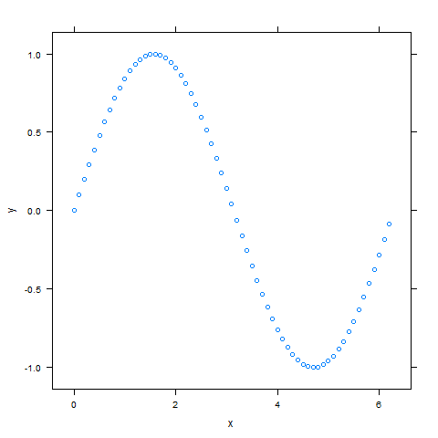
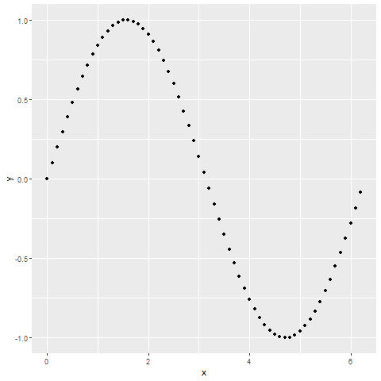

## R 绘图系统简介

#### 绘图系统

- 目前 R 语言的绘图系统主要有三种: base、lattice 以及 ggplot2 (后两者基于 grid 绘图系统开发), 三个系统互不兼容.

base 绘图系统（**graphics** 包）一般通过高级函数作图, 再用低级函数在已有图形上修改或添加新的元素, "需要什么就画什么", 绘图逻辑直观清晰. lattice 绘图系统（**lattice** 包）与ggplot2 绘图系统 (**ggplot2** 包) 的空间布局与元素选取更自动化, 生成的默认图形更美观, 且更倾向于一次成图. 以下用三个系统在参数默认状态下分别作图.

base 绘图系统: 


lattice 绘图系统:



ggplot2 绘图系统:



#### 绘图设备

- 关于 R 语言绘图系统, 还需了解绘图设备. 其包含窗口和图形两种: 
     - 窗口设备指屏幕上的绘图窗口, 默认情况下调用绘图函数时, 图形将绘制于此;
     - 图形设备指绘图结果被保存到文件 (一般默认工作目录)中.

例如将上述 ggplot2 绘图结果以 PDF 格式保存:

```r
pdf(file = "ggplot.pdf", width = 5, height = 4)
qplot(x, y)
dev.off() # 关闭图形设备
```

- 其他图形设备函数

图形格式                     | 函数
---------------------------- |-------
Adobe PDF                    | pdf()
SVG(仅支持 Linux 或 MacOS X) | svg()
WMF(仅支持 Windows)          | win.metafile()
PNG                          | png()
TIFF                         | tiff()
JPEG                         | jpeg()
BMP                          | bmp()
LATEX PicTEX                 | pictext()

以上函数均在 **grDevices** 包（默认安装）中, 还有一些其他包提供图形设备函数, 如 **Cairo**, **RSVGTipsDevice** 等. 另外, 若是使用 **ggplot2** 作图, 可使用 `ggsave()` 函数以保存结果.


