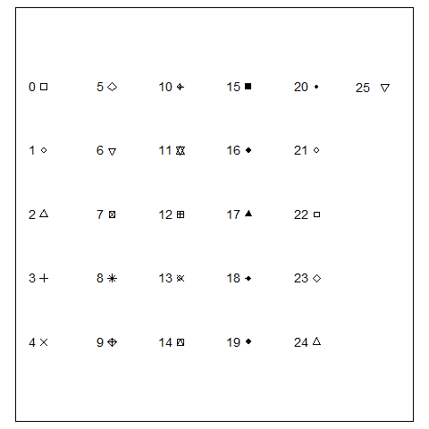
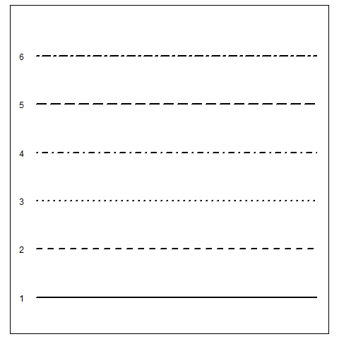
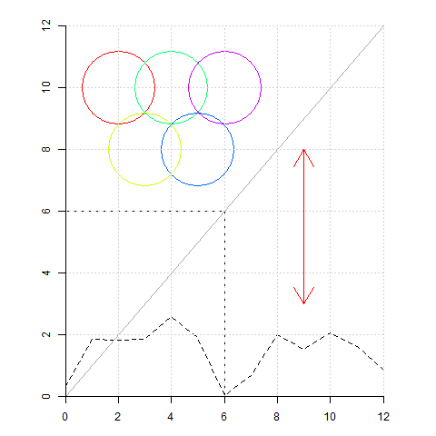
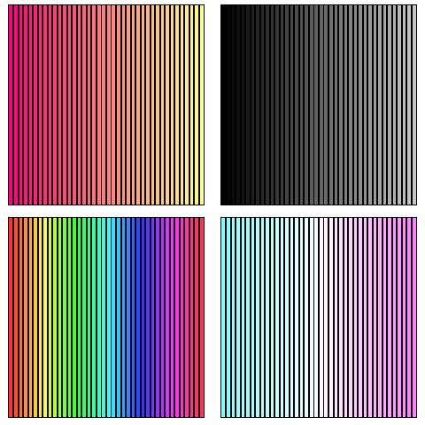
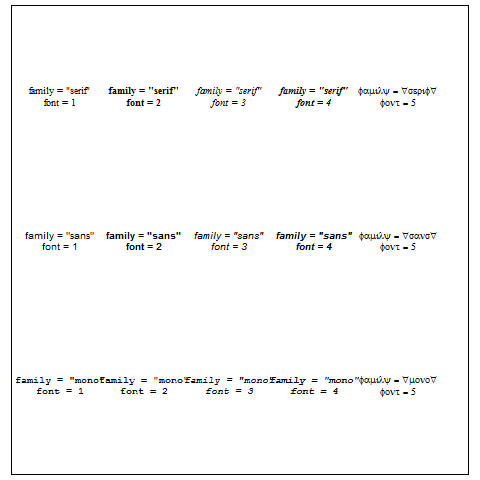
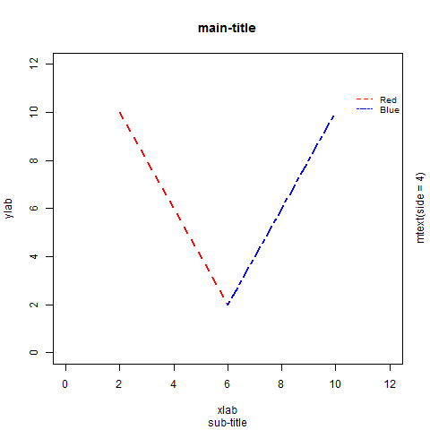
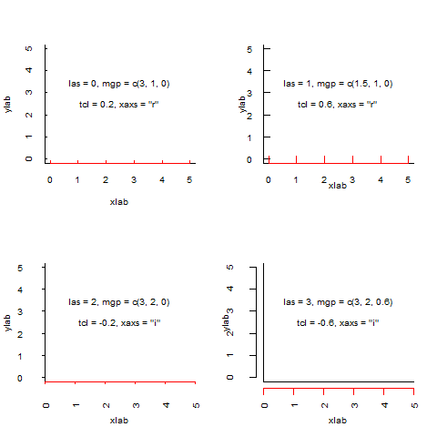
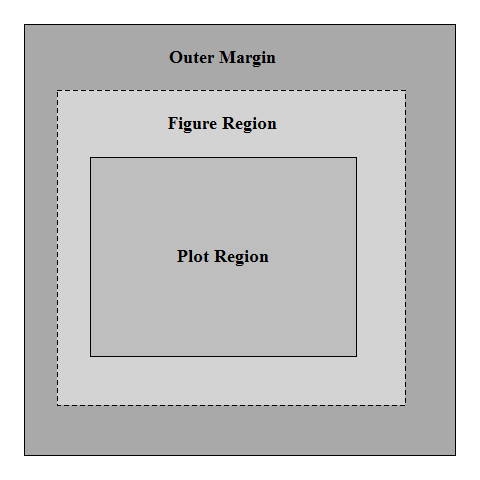

## 基本图形参数

- 高级函数作出的图形包含默认的参数设置, 若无法满足要求, 则可对已有图形进行修饰: 修改参数值或通过低级函数添加新的元素.

- 图形参数可通过函数 `par()` 或者具体作图函数(如 `plot()` 或 `lines()`)的参数进行修改, 二者的区别在于前者的设置持续起作用, 后者的设置起临时作用. 同时应注意, 有些参数只能通过函数 `par()` 设置 (粗体标识). 这里介绍常用的参数以及一些可添加元素的低级函数.

### 符号与线条

参数      | 描述
--------- | -------
pch       | 数据点的形状 (取值 0-25，21-25 可填充颜色), 参见图 2.11
cex       | 数据符号或文本的大小, 表示相对于默认大小的缩放倍数
lty       | 线条类型 (取值 1-6), 参见图 2.12
lwd       | 线条宽度, 表示相对于默认大小的缩放倍数
ljoin     | 线条连接处的类型 (取值 0-2)
lend      | 线条末端的类型 (取值 0-2)


##### 图 2.11



##### 图 2.12



- 用以添加符号或线条的低级函数, 效果参见图 2.13

函数        | 描述                        | 用法
----------- | --------------------------- | ---------
points()    | 在坐标点 (x, y)处绘制符号   | points(x, y, type, ...)
lines()     | 在坐标点 (x, y)之间绘制线条 | lines(x, y, type, ...)
abline()    | 通过斜率和截距绘制一条直线  | abline(a, b, h, v, ...)
segments()  | 在两个坐标之间绘制线段      | segments(x1, y1, x2, y2, ...)
arrows()    | 绘制箭头线                  | arrows(x1, y1, x2, y2, length, angle, code, ...)
xspline()   | 绘制光滑曲线                | xspline(x, y, shape, open, ...)
grid()      | 绘制网格线                  | grid(nx, ny, ...)

##### 图 2.13



### 颜色

参数      | 描述
--------- | -------
col       | 符号和线条的颜色
col.axis  | 坐标轴刻度文字的颜色
col.lab   | 坐标轴标签的颜色
col.main  | 主标题颜色
col.sub   | 副标题颜色
fg        | 前景色
bg        | 背景色

- 颜色设置可通过直接指定颜色名称, 如 "red"

- 或通过函数 `rgb()`, `hsv()`, `hcl()`, `gray()` 等生成系列颜色, 例子参见图 2.14 左上和右上

- 或通过颜色集合函数 `rainbow()`, `heat.colors()`, `terrain.colors()`, `topo.colors`, `cm.colors`生成渐变色，例子参见图 2.14 左下和右下

##### 图 2.14



### 文本

参数         | 描述
------------ | -------
**ps**       | 文本尺寸, 指定字体的绝对大小
cex          | 指定字体相对于默认大小的缩放倍数, 文本的最终大小为 ps * cex
cex.axis     | 坐标轴刻度文字的缩放倍数
cex.lab      | 坐标轴标签的缩放倍数
cex.main     | 主标题的缩放倍数
cex.sub      | 副标题的缩放倍数
family       | 文本字体族, 标准的取值有serif(衬线)、sans(无衬线) 和 mono(等宽), 参见图 2.15
font         | 字体样式, 1 = 常规, 2 = 粗体, 3 = 斜体, 4 = 粗斜体, 5 = 符号字体(以 Adobe 符号编码表示), 参见图 2.15
font.axis    | 坐标轴刻度文字的字体样式
font.lab     | 坐标轴标签 (名称) 的字体样式
font.main    | 标题的字体样式
font.sub     | 副标题的字体样式
adj          | 文本水平或垂直移动, 取值 0-1, 默认 c(0.5, 0.5)
srt          | 文本旋转角度, 起点为 x 轴正方向
**lheight**  | 多行文本的间隔, 默认为 1

##### 图 2.15



- 用以添加文本的低级函数, 效果参见图 2.16

函数        | 描述                        | 用法
----------- | --------------------------- | ---------
title()     | 添加标题及坐标轴标签        | title(main, sub, xlab, ylab, ...)
text()      | 在坐标点 (x, y) 处添加文本  | text(x, y, labels, ...)
mtext()     | 在边界添加文本              | mtext(text, side, line, outer, at, ...)
legend()    | 添加图例                    | legend(x, y, legend, fill, angle, density, ...)

##### 图 2.16

```r
png(file = "pic-Rplot-26.png")
plot(1:10, type = "n", xlim = c(0, 12), ylim = c(0, 12), xlab = "", ylab = "")
title(main = "main-title", sub = "sub-title", xlab = "xlab", ylab = "ylab")
segments(c(2, 6), c(10, 2), c(6, 10), c(2, 10), lty = c(2, 6), col = c("red", "blue"), lwd = 2)
legend(10.5, 11, c("Red", "Blue"), lty = c(2, 6), col = c("Red", "Blue"), cex = 0.8, bty = "n")
mtext("mtext(side = 4)", side = 4, line = 0.8, outer = FALSE, las = 0)
```


### 坐标轴

参数           | 描述
-------------- | -------
lab            | 坐标轴刻度线数目, 形式为 c(x, y, len)
las            | 坐标轴刻度标签样式, 0 = 平行于坐标轴, 1 = 总是水平, 2 = 垂直于坐标轴, 3 = 总是竖直, 参见图 2.17
mgp            | 默认为 c(3, 1, 0), 三个数字分别表示坐标轴标题、刻度线标签、坐标轴线偏离绘图区域的文本行数, 参见图 2.17
tcl            | 坐标轴刻度线的长度, 取值为一文本行高的缩放比, 正值表明刻度线向内画, 负值表明刻度线向外画, 参见图 2.17
tck            | 坐标轴刻度线的长度, 默认为 NA(不使用)
xaxs, yaxs     | 坐标轴范围的计算方式, 默认 "r", 表示坐标轴范围比原始数据范围大; 还可取 "i", 表示两个范围一致, 参见图 2.17
xaxt, yaxt     | 坐标轴类型, 默认 "s", 表示需要绘制坐标轴; "n"则表示不需要绘制坐标轴, 但会留下框架线
xaxp, yaxp     | 坐标轴刻度的个数
**xlog, ylog** | 坐标是否取对数, 默认 FALSE
**usr**        | 坐标轴尺度范围, c(x1, x2, y1, y2), 分别表示x轴的左右极限和y轴的下上极限

##### 图 2.17



- 用以添加坐标轴的低级函数 `axis()` 的主要参数如下:

参数      | 描述
----------| -------
side      | 整数, 表示在图形的哪侧绘制坐标轴 (1 = 下, 2 = 左, 3 = 上, 4 = 右)
at        | 数值型向量, 指明需要绘制刻度线的位置
labels    | 字符型向量, 表示置于刻度线旁边的文字标签
pos       | 坐标轴线绘制位置的坐标 (即与另一条坐标轴交点的值)
tck       | 刻度线的长度, 以相对于绘图区域大小的分数表示 (负值表示在图形外侧, 正值表示在图形内侧, 0 表示禁用刻度, 1 表示绘制网格线). 默认值为 0.01

### 绘图区域

- R 语言的绘图设备分为三个区域: 绘图区域 (Plot Region)、图像区域 (Figure Region)、设备区域 (Device Region), 对应着两个边界: 外边界 (Outer Margin)、图像边界 (Figure Margin), 具体参见图 2.18.

- 最里面的灰色区域为*绘图区域*; 虚线以内的区域为内部区域，当只有一个图像时就是*图像区域*, 当有多个图像时, 内部区域对应着多个图像区域的总和; 浅灰色区域 (图像区域除去绘图区域) 为*图像边界*; 深灰色区域为*外边界*, 默认不显示; 整个图形设备内的区域则为*设备区域*. 可通过参数控制这些区域大小.

##### 图 2.18
       


参数          | 描述
------------- | -------
**oma**       | 外边界大小, 默认 c(0, 0, 0, 0), 四个数分别表示下、左、上、右边界大小, 单位为文本行
**mar**       | 图像边界大小, 默认 c(5, 4, 4, 2) + 0.1, 四个数分别表示下、左、上、右边界大小, 单位为文本行
**mai**       | 图像边界大小, 顺序为下、左、上、右, 单位为英尺
**mex**       | 图像边界大小, 默认为 1, 表示一个文本行的高度, 文本行高度由边界文本尺寸* mex 决定, 此参数会影响 mgp 参数
**fin**       | 图像区域大小, c(width, height), 单位为英尺
**pin**       | 绘图区域大小, c(width, height), 单位为英尺
**pty**       | 绘图区域形状, 默认 "m", 表示占据全部可用空间, "s" 表示绘图区域为正方形
xpd           | 超出边界的剪切方式, 取值 FALSE (默认), 表示剪切超出绘图区域部分; TRUE, 表示剪切超出图像区域部分; NA, 表示剪切超出设备区域部分
**din**       | 图形设备尺寸, 单位为英尺, 只可查询不可修改


