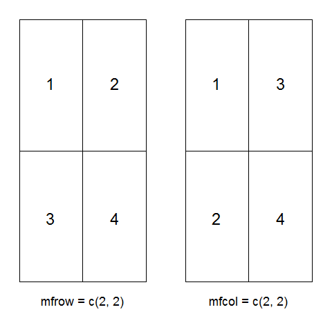
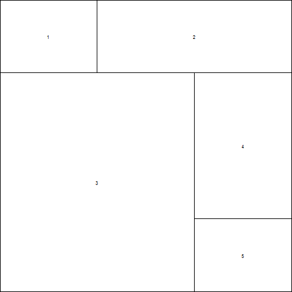

## 图形布局与组合

- 同一个页面内绘制多个图像, 目前有三种方法: 
    - 设置布局参数
    - 布局设计 (函数 `layout()`)
    - split-screen 方法

### 布局参数

- 函数 `par()` 中使用参数 `mfrow = c(nrows, ncols)` 可以建立以行填充、行数为 nrows、列数为 ncols 的图形矩阵; 参数 `mfcol = c(nrows, ncols)` 可以建立以列填充、行数为 nrows、列数为 ncols 的图形矩阵, 参见图 3.11

##### 图 3.11



### 布局设计

- 函数 `layout()` 可实现对图像更精细的布局(参见图 3.12), 其主要参数如下: 

参数   | 描述
------ | ------
mat    | 矩阵, 提供绘图顺序以及版面安排, 其行数和列数决定页面布局的行数和列数
widths | 各列宽度值组成的一个向量, 表示各列宽度的比例
heights| 各行高度值组成的一个向量, 表示各行高度的比例

##### 图 3.12

```r
png(file = "pic-Rplot-32.png")
layout(matrix(c(1, 2, 2, 3, 3, 4, 3, 3, 5), byrow = TRUE, 3), heights = c(1, 2, 1), widths = c(1, 1, 1))
layout.show(5)
```


### split-screen 方法

- 函数 `split.screen()` 可将页面分割成不同数目的图像区域, 也可指定绘图区域在屏幕上的位置, 其参数如下: 

参数   | 描述
------ | ------
figs   | 长度为 2 的向量(指定行列数目), 或者一个 4 列的矩阵(指定绘图区域坐标轴位置, 取值 0-1)
screen | 区域编号


