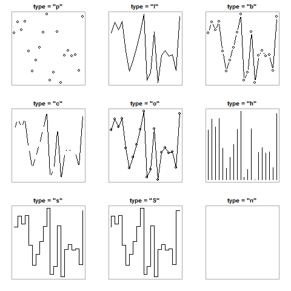
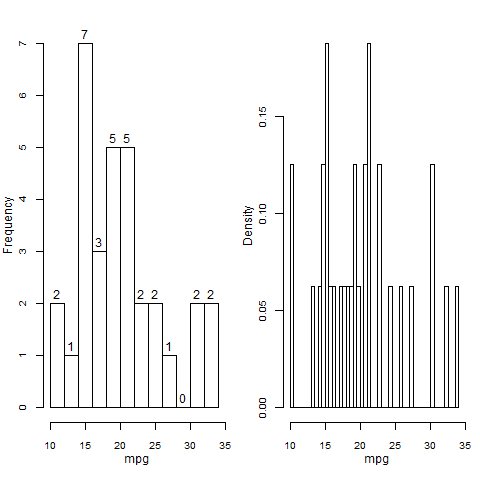
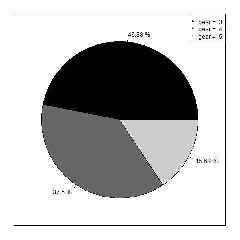

## 统计图形绘制

- 基于 base 绘图系统的统计图形函数为高级函数, 可绘制完整图形, 各自有独特参数, 同时前文介绍的 `par()` 参数仍可调用以修饰原图.

### 散点图

- 常用来探索两个变量之间的关系, 函数 `plot()` 可绘制散点图, 但因其为泛型函数, 所以对象数据类型不同, 绘制出的图也不同, 通常需提供两个数值型向量以绘制散点图, 基本格式如下: 

```
plot(x, y, type = "", main = "", sub = "", xlab = "", ylab ="", xlim, ylim, asp, ann, axes, ...)
```
主要参数   | 描述
---------- | --------
x, y       | 横纵坐标
type       | 图形样式, 共九种, 参见图 4.11
mian, sub  | 主标题, 副标题
xlab, ylab | x 轴标签, y 轴标签
xlim, ylim | 坐标轴范围
asp        | 图形纵横比, 通常不是 1
ann        | 逻辑值, 是否绘制标题与标签
axes       | 逻辑值, 是否绘制坐标轴 (不会留下框架线)

##### 图 4.11



### 条形图

- 函数 `barplot()` 可绘制条形图, 以条形长度展示数值大小, 基本格式如下 (参见图4.12):

```
barplot(height, width, space, legend.text, beside, horize, ...)
```
主要参数   | 描述
---------- | -------------
height     | 长条高度, 可为向量或矩阵
width      | 长条宽度
space      | 长条之间的距离
beside     | FALSE = 并列条形, TRUE = 堆砌条形
legend.text| 是否绘制图例, 可为向量或逻辑值
horize     | 逻辑值, 设置长条方向, 水平或垂直

##### 图 4.12

```r
par(mfrow = c(1, 2))
height <- table(mtcars$cyl, mtcars$gear)
barplot(height, beside = TRUE, legend.text = c("cyl = 4", "cyl = 6", "cyl = 8"), horiz = FALSE, xlab = "gear", ylab = "Frequency")
barplot(height, beside = FALSE, legend.text = TRUE, horiz = TRUE, ylab = "gear", xlab = "Frequency")
```


### 直方图

- 函数 `hist()` 可绘制直方图, 基本格式如下 (参见图 4.13): 

```
hist(x, breaks, freq, probility, labels, ...)
```
主要参数   | 描述
---------- | -------------
x          | 待估计分布的数值向量
breaks     | 计算分段区间的方法, 可为一个向量、数字、字符串、函数
freq       | 逻辑值, 是否以频数作图
probability| 逻辑值, 是否以概率密度作图 (与 freq 互斥)
labels     | 逻辑值, 是否将频数数值绘制于长条上方

##### 图 4.13

```r
par(mfrow = c(1, 2), mar = c(4, 3, 2, 0.5), mgp = c(2, 1, 0), cex.axis = 0.8, xpd = TRUE)
mpg <- mtcars$mpg
hist(mpg, xlim = c(10, 35), breaks = 10, freq = TRUE, labels = TRUE, main = "")
hist(mpg, xlim = c(10, 35), breaks = 50, freq = FALSE, labels = FALSE, main = "")
```



- 可通过函数 `lines(density())` 添加密度曲线, 函数 `rug()` 添加轴须图, 参见图4.14

##### 图 4.14


### 箱线图

- 函数 `boxplot()` 可绘制箱线图, 基本格式如下 (参见图4.15):

```
boxplot(formula, range, notch, horizontal, varwidth...)
```
主要参数   | 描述
---------- | -------------
formula    | 示例公式 y ~ A, 将为类型变量 A 的每个值并列生成数据变量 y 的箱线图
range      | 延伸倍数, 表示箱线图末端延伸到的位置
notch      | 逻辑值, 是否在箱子上绘制凹槽
horizontal | 逻辑值, 箱线图是否水平
varwidth   | 逻辑值, 箱线图宽度与样本大小的平方根是否成正比

##### 图 4.15

```r
par(mfrow = c(1, 2), mar = c(4, 4, 2, 1), mgp = c(2.5, 1, 0))

boxplot(mpg ~ cyl, data = mtcars, notch = FALSE, varwidth = FALSE)
boxplot(mpg ~ cyl, data = mtcars, notch = TRUE, horizontal = TRUE)
```


### 茎叶图

- 函数 `stem()` 可绘制茎叶图, 其结果仅在界面中展示, 不可生成图形输出, 基本格式如下:  

```
stem(x, scale, width, ...)
```
主要参数   | 描述
---------- | -------------
x          | 数值向量
scale      | 区间长度
width      | 控制茎叶图的宽度

### 饼图

- 函数 `pie()` 可绘制饼图, 基本格式为 (参见图 4.16):

```
pie(x, labels)
```
- x 是一个非负值向量, 表示每个扇形的面积; labels 表示各扇形标签的字符型向量

##### 图4.16

```r
png(file = "pic-Rplot-46.png")
x <- table(mtcars$gear)
legend_text <- paste("gear = ", seq(3, 5, 1))
lab <- paste(round(x/sum(x)*100, 2), "%")
par(mar = c(2, 2, 2, 2))
pie(x, labels = lab, col = gray(c(0, 0.4, 0.8)))
legend("topright", legend_text, pch = 20, col = gray(c(0, 0.4, 0.8)))
box()
```




